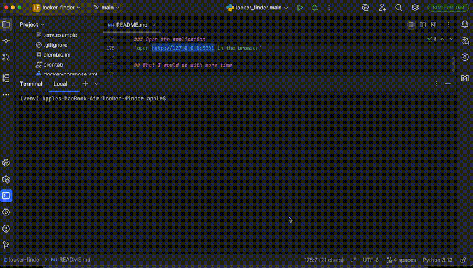

# LockerFinder

## Overview
LockerFinder is a web app that helps users find InPost parcel lockers across Poland.
It detects user's location and displays ten nearest lockers on a map, or lets users browse
all lockers across Poland. Clicking a locker marker shows information about the locker, 
including:
- locker name
- address 
- opening hours 
- current status

The app helps users quickly find a convenient parcel locker without using InPost’s interface.

## Demo & Description


### How it works

### Data import and validation
When the application starts:
1. Locker data is fetched from an external API
2. Invalid/test data is filtered out
3. Only lockers located in Poland are processed
4. The cleaned data is saved in a PostgreSQL database

The database is seeded only once. Docker volumes keep the data persistent between container restarts.

### Location-Based Search
**"Near me" mode**<br>
"Near me" is the default mode. In this mode the frontend requests the user's current location from the browser and sends the coordinates as query parameters to the backend.

Using latitude and longitude values, backend:
- Queries the database
- Finds the ten nearest lockers
- Formats the results as JSON
- Sends the response to the frontend

The frontend then renders the lockers as map markers.

**"All" mode** <br>
When the user selects the "All" option, the backend returns all locker records stored in the database. The frontend renders every locker on the map using its coordinates from the database.

In both modes, clicking a marker displays locker information, including:
- name
- address 
- opening hours 
- current status
- Google Maps navigation link

To improve usability and performance, markers are automatically grouped into clusters when zooming out.

### Database & Migrations

The PostgreSQL database runs inside a Docker container using an external PostgreSQL image.

During initialization:
- the locker_finder_db database is created
- the locker_finder schema and the lockers table are created through migration

Database schema migration is managed with Alembic.

### Synchronization & Scheduling

To keep the local database synchronized with the external API, the application uses a scheduled synchronization mechanism powered by Cron.

The scheduler once a day:
- fetches API data and stores it in a temporary table
- copies data from the temporary table in lockers table
- if data doesn't exist in the table, inserts a new row
- if data is in the table, updates the existing row with a new value
- removes rows from the table that are not present in the temporary table.

This ensures that lockers table remains up to date without requiring manual changes in the database.

The backend and frontend run in a single Docker container. Since the frontend is mainly a single index.html file served by Flask, a separate frontend service was not needed.

## Technologies

### Backend:
- Python
- Flask

### Frontend:
- HTML5
- CSS3
- JavaScript
- Leaflet library

### Database:
- PostgreSQL
- SQLModel ORM
- Alembic (migration tool)

### Containerization:
- Docker & Docker Compose

### Scheduler:
- Cron

### Version Control tools:
- Git & GitHub

## How to run

From the root of the project run:
`make up`

### Prerequisites
python 3.13<br>
flask 3.1<br>
psycopg2-binary<br>
requests 2.28<br>
python-dotenv<br>
sqlmodel 0.0.38<br>
alembic 1.16.5<br>

### Build & run
```bash
# 1. Clone the repository and move to the locker-finder folder
git clone https://github.com/alrltgit/locker-finder.git locker-finder
cd locker-finder

# 2. Create virtual environment
python3 -m venv venv

# 3. Activate virtual environment
# Linux / MacOS
source venv/bin/activate
# Windows
venv\Scripts\activate

# 4. IMPORTANT: Start Docker Desktop
# (Make sure Docker Desktop is running before continuing)

# 5. Create folders
make init

# 6. Open .env and set your values: POSTGRES_USER, POSTGRES_PASSWORD, POSTGRES_DB

# 7. Run the application (initial setup)
make setup
```

### Other commands
```bash
make down # stop containers

make up # start containers on not initial setups
```

### Open the application
`open http://127.0.0.1:5001 in the browser`

## What I would do with more time

If I had one more week, I would add more filtering options — for example, letting users show only active lockers or lockers of a specific type. 
This would make searching more convenient.<br>
I would also add tests for the app.

## AI usage

I used Claude and ChatGPT throughout the project as development assistants. They helped me with:

**Docker & deployment** — setting up docker-compose.yml, writing the Dockerfile, and configuring Alembic migrations to run on container startup

**Backend** — planning the data synchronization between the InPost API and the database

**Frontend** — generating JavaScript code, fixing bugs, improving marker rendering performance, and writing CSS

**Software architecture** — designing the project structure, including models and package organization

I verified and adapted the generated output by:
- running the code and checking if it worked as expected
- reading error logs and understanding issues before applying fixes
- adjusting suggestions to match my project structure instead of copying them directly

## Anything else?

The initial idea was to build an app that shows the ten nearest lockers based on the user’s location. Later, I added an option to view all locker locations across Poland to make the app more useful than just local search.

I decided to keep everything in a single backend service using Flask because the frontend is small and does not need a separate framework or build setup.

During development, I also needed a fast way to store a large amount of paginated API data in the database. Saving records one by one was too slow, so I improved the process by fetching multiple API pages in parallel using a thread pool.

After fetching the data, instead of inserting rows one by one, I collected everything in memory and used a bulk insert approach with PostgreSQL COPY and a temporary staging table to load the data into the database.
